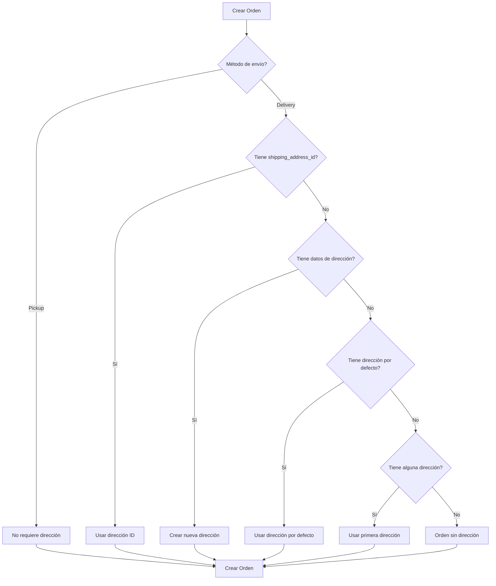

# 📍 Manejo de Direcciones en Órdenes

## 📋 Resumen

Sistema automatizado para manejar direcciones de envío en las órdenes. Las direcciones se crean o asignan automáticamente según la disponibilidad.

## 🔧 Implementación

### **1. Scripts SQL para Datos de Ejemplo**

#### **Script Rápido** (`scripts/quick-add-addresses.sql`)
```sql
-- Ejecutar en Supabase SQL Editor
-- Crea direcciones automáticamente para usuarios sin dirección
-- y actualiza órdenes sin shipping_address_id
```

**Qué hace:**
1. Crea dirección de ejemplo para usuarios que tienen órdenes pero no tienen direcciones
2. Actualiza automáticamente las órdenes sin `shipping_address_id`
3. Muestra reporte de resultados

#### **Script Completo** (`scripts/add-sample-addresses-and-update-orders.sql`)
- Incluye ejemplos de direcciones específicas
- Script automatizado con cursores PL/pgSQL
- Verificaciones y reportes detallados

### **2. API de Creación de Órdenes Mejorada**

**Endpoint:** `POST /api/orders/create`

#### **Lógica de Manejo de Direcciones:**

```typescript
// Prioridad de asignación de dirección:

1. Si el método es pickup (recojo en tienda)
   → No se requiere dirección

2. Si se proporciona shipping_address_id
   → Usar esa dirección

3. Si se proporcionan datos de shipping_address
   → Crear nueva dirección con esos datos

4. Si no hay dirección proporcionada
   → Buscar dirección por defecto del usuario
   
5. Si no hay dirección por defecto
   → Buscar cualquier dirección de shipping del usuario
   
6. Si no existe ninguna dirección
   → La orden se crea sin dirección (shipping_address_id = null)
```

#### **Payload de Ejemplo:**

**Opción 1: Usar dirección existente**
```json
{
  "shipping_method": "delivery",
  "shipping_address_id": "uuid-de-direccion-existente",
  "payment_method": "credit_card",
  "customer_notes": "Entregar en horario laboral"
}
```

**Opción 2: Crear nueva dirección**
```json
{
  "shipping_method": "delivery",
  "shipping_address": {
    "label": "Casa - Quito Centro",
    "street": "Av. 10 de Agosto N35-123 y Naciones Unidas",
    "city": "Quito",
    "province": "Pichincha",
    "postal_code": "170135",
    "country": "Ecuador",
    "phone": "0991234567",
    "is_default": false
  },
  "payment_method": "credit_card",
  "customer_notes": "Casa azul con portón negro"
}
```

**Opción 3: Pickup (sin dirección)**
```json
{
  "shipping_method": "pickup_quito",
  "pickup_location": "aloag",
  "payment_method": "cash",
  "customer_notes": "Recogeré mañana"
}
```

## 📊 Estructura de Tabla `addresses`

```sql
CREATE TABLE addresses (
  id UUID PRIMARY KEY,
  user_id UUID REFERENCES users(id),
  label TEXT NOT NULL, -- Ej: 'Casa', 'Oficina', 'Bodega'
  street TEXT NOT NULL,
  city TEXT NOT NULL,
  province TEXT NOT NULL,
  postal_code TEXT,
  country TEXT DEFAULT 'Ecuador',
  phone TEXT NOT NULL,
  is_default BOOLEAN DEFAULT false,
  coordinates JSONB,
  created_at TIMESTAMP,
  updated_at TIMESTAMP
);
```

## 🔄 Flujo de Creación de Orden



## 📝 Campos de Dirección

### **Requeridos:**
- `label` - Etiqueta descriptiva (Ej: 'Casa', 'Oficina', 'Bodega')
- `street` - Dirección completa
- `city` - Ciudad
- `province` - Provincia
- `phone` - Teléfono de contacto
- `country` - País (default: Ecuador)

### **Opcionales:**
- `postal_code` - Código postal
- `is_default` - Marcar como dirección por defecto
- `coordinates` - Coordenadas geográficas (JSONB)

## 🎯 Casos de Uso

### **Caso 1: Primera Orden del Usuario**
```javascript
// El usuario no tiene direcciones previas
// Se crea automáticamente una con los datos proporcionados
const order = await createOrder({
  shipping_method: 'delivery',
  shipping_address: {
    label: 'Casa - Quito Norte',
    street: 'Av. Principal 123 y Calle Secundaria',
    city: 'Quito',
    province: 'Pichincha',
    postal_code: '170150',
    country: 'Ecuador',
    phone: '0991234567'
  },
  payment_method: 'credit_card'
});
```

### **Caso 2: Usuario con Dirección Registrada**
```javascript
// El usuario ya tiene dirección por defecto
// Se usa automáticamente si no se especifica otra
const order = await createOrder({
  shipping_method: 'delivery',
  payment_method: 'bank_transfer'
});
// Usará la dirección por defecto automáticamente
```

### **Caso 3: Pickup en Tienda**
```javascript
// No requiere dirección de envío
const order = await createOrder({
  shipping_method: 'pickup_quito',
  pickup_location: 'aloag',
  payment_method: 'cash'
});
```

## ⚙️ Configuración Inicial

### **Paso 1: Ejecutar Script SQL**
```bash
# En Supabase SQL Editor, ejecutar:
scripts/quick-add-addresses.sql
```

### **Paso 2: Verificar Direcciones**
```sql
SELECT * FROM addresses LIMIT 10;
```

### **Paso 3: Verificar Órdenes Actualizadas**
```sql
SELECT 
  o.order_number,
  o.shipping_address_id,
  a.street_address,
  a.city
FROM orders o
LEFT JOIN addresses a ON o.shipping_address_id = a.id
LIMIT 10;
```

## 🔍 Consultas Útiles

### **Ver órdenes sin dirección:**
```sql
SELECT * FROM orders 
WHERE shipping_address_id IS NULL 
AND shipping_method NOT IN ('pickup_quito', 'pickup_milagro');
```

### **Ver usuarios sin dirección:**
```sql
SELECT DISTINCT u.id, u.email
FROM users u
WHERE u.id NOT IN (
  SELECT user_id FROM addresses WHERE user_id IS NOT NULL
)
AND u.id IN (
  SELECT user_id FROM orders WHERE user_id IS NOT NULL
);
```

### **Crear dirección por defecto para usuario:**
```sql
INSERT INTO addresses (
  user_id, label, street, 
  city, province, postal_code, country, 
  phone, is_default
)
VALUES (
  'USER_ID_AQUI',
  'Casa Principal',
  'Av. Ejemplo 123 y Calle Principal',
  'Quito',
  'Pichincha',
  '170150',
  'Ecuador',
  '0991234567',
  true
);
```

## 🛡️ Validaciones

1. **Shipping Method = Delivery:**
   - Intenta usar dirección existente o crear una nueva
   - Si no puede, la orden se crea sin dirección (requiere actualización posterior)

2. **Shipping Method = Pickup:**
   - No requiere dirección
   - Usa `pickup_location` en su lugar

3. **Dirección Por Defecto:**
   - Solo puede haber una dirección por defecto por usuario y tipo
   - Al crear una nueva como por defecto, se actualiza la anterior

## 📈 Mejoras Futuras

1. ✅ Validación de direcciones con API de geolocalización
2. ✅ Autocompletado de direcciones
3. ✅ Gestión de múltiples direcciones en el perfil del usuario
4. ✅ Validación de código postal según ciudad
5. ✅ Integración con servicios de mensajería para tracking

## 🐛 Troubleshooting

### **Problema: Orden sin dirección**
```sql
-- Solución: Asignar dirección manualmente
UPDATE orders 
SET shipping_address_id = 'ADDRESS_ID'
WHERE id = 'ORDER_ID';
```

### **Problema: Usuario sin dirección**
```sql
-- Solución: Crear dirección de ejemplo
INSERT INTO addresses (user_id, label, street, city, province, country, phone, is_default)
VALUES ('USER_ID', 'Dirección Temporal', 'Calle Ejemplo 123', 'Ciudad', 'Provincia', 'Ecuador', '0999999999', true);
```

## ✅ Checklist de Implementación

- [x] Scripts SQL para datos de ejemplo
- [x] Lógica de asignación automática de direcciones
- [x] Endpoint de creación de órdenes actualizado
- [x] Documentación completa
- [ ] Ejecutar script SQL en Supabase
- [ ] Verificar órdenes actualizadas
- [ ] Probar creación de órdenes con diferentes escenarios
