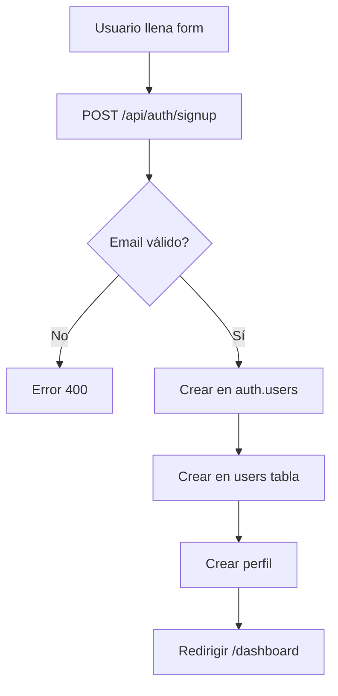
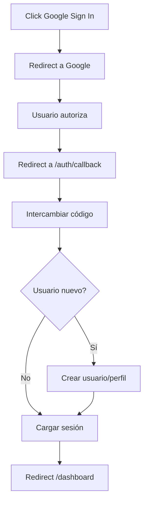

# Authentication API

## Descripción

Sistema de autenticación completo con soporte para Email/Password y Google OAuth.

## Endpoints

### Sign Up (Email/Password)

#### POST `/api/auth/signup`

Registra un nuevo usuario con email y contraseña.

**Body**:
```json
{
  "email": "usuario@ejemplo.com",
  "password": "Password123!",
  "full_name": "Juan Pérez",
  "phone": "0999999999"
}
```

**Response**:
```json
{
  "success": true,
  "data": {
    "user": {
      "id": "uuid",
      "email": "usuario@ejemplo.com"
    }
  }
}
```

**Flujo**:
1. Valida formato de email
2. Valida fortaleza de contraseña
3. Crea usuario en `auth.users`
4. Crea registro en tabla `users` (role: 'customer')
5. Crea perfil en `user_profiles`
6. Redirige a `/dashboard`

### Sign In (Email/Password)

#### POST `/api/auth/signin`

Inicia sesión con email y contraseña.

**Body**:
```json
{
  "email": "usuario@ejemplo.com",
  "password": "Password123!"
}
```

**Response**:
```json
{
  "success": true,
  "data": {
    "user": {
      "id": "uuid",
      "email": "usuario@ejemplo.com"
    }
  }
}
```

### Sign Out

#### POST `/api/auth/signout`

Cierra la sesión del usuario actual.

**Response**:
```json
{
  "success": true
}
```

### Google OAuth

#### Inicio de Sesión

```typescript
const { data } = await supabase.auth.signInWithOAuth({
  provider: 'google',
  options: {
    redirectTo: `${window.location.origin}/auth/callback`,
    queryParams: {
      access_type: 'offline',
      prompt: 'consent'
    }
  }
})
```

#### Callback Handler

**GET** `/auth/callback`

Maneja el callback de OAuth después de la autenticación.

**Query Parameters**:
- `code`: Código de autorización de Supabase
- `next`: URL de redirección opcional (default: `/dashboard`)
- `error`: Error de OAuth (si aplica)
- `error_description`: Descripción del error

**Flujo**:
1. Recibe `code` de Supabase
2. Intercambia código por sesión
3. Si es usuario nuevo:
   - Crea registro en `users` (role: 'customer')
   - Crea perfil en `user_profiles`
4. Redirige a `next` URL o `/dashboard`

### Auth Handler (Client)

Componente cliente que intercepta redirects de OAuth en la ruta raíz.

```typescript
// app/auth-handler.tsx
// Detecta parámetro 'code' en URL
// Redirige a /auth/callback?code=...
```

## Roles de Usuario

### Customer (Cliente)
- **Asignado por**: Registro automático
- **Permisos**: 
  - Ver productos
  - Crear órdenes
  - Ver sus órdenes
  - Gestionar carrito

### Sales Rep (Representante de Ventas)
- **Asignado por**: Admin
- **Permisos**:
  - Todo de Customer +
  - Ver productos (gestión)
  - Crear cotizaciones
  - Ver órdenes asignadas

### Admin (Administrador)
- **Asignado por**: Super Admin
- **Permisos**:
  - Todo de Sales Rep +
  - Gestionar productos (CRUD)
  - Ver estadísticas
  - Gestionar inventario
  - Procesar todas las órdenes

## Middleware de Protección

### Server-Side (API Routes)

```typescript
import { createClient } from '@/lib/supabase/server'

export async function GET(request: NextRequest) {
  const supabase = await createClient()
  const { data: { user }, error } = await supabase.auth.getUser()
  
  if (error || !user) {
    return NextResponse.json(
      { error: 'No autenticado' }, 
      { status: 401 }
    )
  }

  // Verificar rol
  const { data: userData } = await supabase
    .from('users')
    .select('role')
    .eq('id', user.id)
    .single()

  if (!['admin', 'sales_rep'].includes(userData.role)) {
    return NextResponse.json(
      { error: 'No autorizado' },
      { status: 403 }
    )
  }
}
```

### Client-Side (Components)

```typescript
import { ProtectedRoute } from '@/components/auth/ProtectedRoute'

export default function Page() {
  return (
    <ProtectedRoute allowedRoles={['admin', 'sales_rep']}>
      <AdminContent />
    </ProtectedRoute>
  )
}
```

## Hooks de Autenticación

### useAuth

```typescript
import { useAuth } from '@/hooks/useAuth'

function Component() {
  const { user, loading } = useAuth()
  
  if (loading) return <Loading />
  if (!user) return <SignIn />
  
  return <Dashboard />
}
```

### useRole

```typescript
import { useRole } from '@/hooks/useRole'

function Component() {
  const { role, isAdmin, isSalesRep, isCustomer } = useRole()
  
  if (isAdmin) return <AdminDashboard />
  if (isSalesRep) return <SalesRepDashboard />
  return <CustomerDashboard />
}
```

## Configuración de OAuth

### Google Cloud Console

1. Crear proyecto
2. Habilitar Google+ API
3. Crear credenciales OAuth 2.0
4. Configurar URLs autorizadas:
   - `http://localhost:3000` (desarrollo)
   - `https://yourdomain.com` (producción)
5. Configurar redirect URIs:
   - `https://[PROJECT_ID].supabase.co/auth/v1/callback`

### Supabase Dashboard

1. Authentication → Providers → Google
2. Habilitar Google provider
3. Ingresar Client ID y Client Secret
4. Guardar configuración

Ver guía completa: [Google OAuth Setup](/docs/guides/auth/google-oauth)

## Seguridad

### Validaciones

- **Email**: Formato válido
- **Password**: Mínimo 8 caracteres, mayúsculas, minúsculas, números
- **Session**: Tokens JWT con expiración
- **CSRF**: Protección automática de Supabase

### Best Practices

1. Nunca exponer `SUPABASE_SERVICE_ROLE_KEY`
2. Usar `SUPABASE_ANON_KEY` en cliente
3. Validar roles en backend (RLS)
4. Usar HTTPS en producción
5. Configurar Row Level Security (RLS)

## Errores Comunes

| Código | Error | Solución |
|--------|-------|----------|
| 400 | Invalid email | Verificar formato de email |
| 400 | Password too weak | Usar contraseña más fuerte |
| 401 | Invalid credentials | Verificar email/password |
| 401 | Session expired | Volver a iniciar sesión |
| 403 | Unauthorized | Verificar permisos de rol |
| 400 | Provider not enabled | Configurar OAuth en Supabase |

## Flujo Completo

### Registro Email/Password



### Login Google OAuth



## Testing

### Mock de Supabase Auth

```typescript
jest.mock('@/lib/supabase/client', () => ({
  createClient: () => ({
    auth: {
      getUser: jest.fn().mockResolvedValue({
        data: { user: { id: '123', email: 'test@test.com' } }
      })
    }
  })
}))
```

### Ejemplo de Test

```typescript
describe('Sign In', () => {
  it('should authenticate user', async () => {
    const response = await fetch('/api/auth/signin', {
      method: 'POST',
      body: JSON.stringify({
        email: 'test@test.com',
        password: 'Password123!'
      })
    })
    
    expect(response.ok).toBe(true)
  })
})
```

