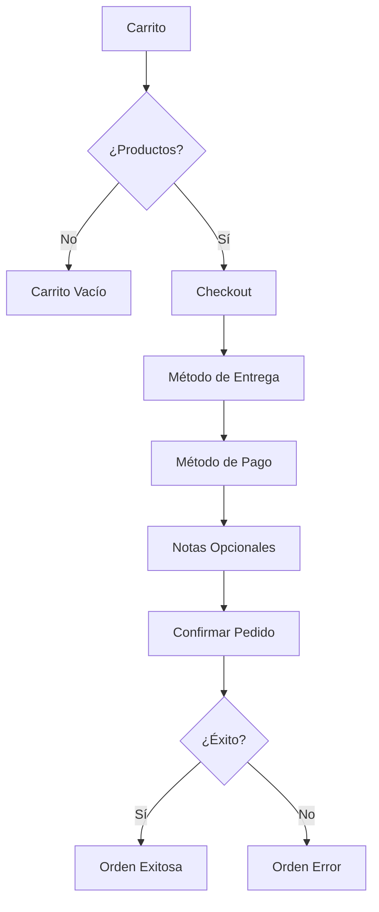

# Sistema de Checkout y Órdenes

El sistema de checkout permite a los usuarios completar sus compras, seleccionar métodos de pago y envío, y gestionar sus órdenes.

## 🎯 Características

- ✅ **Carrito persistente** con cantidades editables
- ✅ **Múltiples métodos de entrega** (Pickup en plantas, Delivery)
- ✅ **Múltiples métodos de pago** (Efectivo, Transferencia, Línea de Crédito)
- ✅ **Cálculo automático** de totales (Subtotal, IVA 15%, Envío)
- ✅ **Validaciones** de carrito y autenticación
- ✅ **Pantallas de confirmación** (éxito/error)
- ✅ **Historial de órdenes** con estados y seguimiento

## 📝 Flujo del Checkout



## 🚀 Uso

### Ir al Checkout

Desde el carrito:

```tsx
import { CartDrawer } from '@/components/CartDrawer';

// En el CartDrawer, el botón de checkout
<Button asChild>
  <Link href="/checkout">Proceder al Pago</Link>
</Button>
```

### Crear una Orden

```typescript
import { createOrder } from '@/services/public/orders/orderService';

const handleCheckout = async () => {
  const result = await createOrder({
    shipping_method: 'pickup_quito',  // 'pickup_quito' | 'pickup_milagro' | 'delivery'
    payment_method: 'cash',           // 'cash' | 'bank_transfer' | 'credit_line'
    customer_notes: 'Entregar en la mañana (opcional)',
  });

  if (result.success) {
    // Redirigir a página de éxito
    router.push(`/orden-exitosa?order=${result.data.order_number}`);
  } else {
    // Mostrar error
    router.push(`/orden-error?error=${result.error}`);
  }
};
```

### Ver Historial de Órdenes

```typescript
import { getMyOrders } from '@/services/public/orders/orderService';

const [orders, setOrders] = useState([]);

useEffect(() => {
  const fetchOrders = async () => {
    const result = await getMyOrders();
    if (result.success) {
      setOrders(result.data);
    }
  };
  fetchOrders();
}, []);
```

## 💰 Cálculo de Totales

El sistema calcula automáticamente:

```typescript
// Subtotal
const subtotal = cartItems.reduce((sum, item) => {
  return sum + (item.products.base_price * item.quantity);
}, 0);

// IVA (15%)
const tax = subtotal * 0.15;

// Envío
const shipping = shipping_method.startsWith('pickup') ? 0 : 10;

// Total
const total = subtotal + tax + shipping;
```

## 📦 Estados de Orden

| Estado | Descripción | Color |
|--------|-------------|-------|
| `pending` | Pendiente de confirmación | 🟡 Amarillo |
| `confirmed` | Confirmada | 🔵 Azul |
| `processing` | En proceso | 🟣 Morado |
| `ready_for_pickup` | Lista para recoger | 🟢 Verde |
| `in_transit` | En tránsito | 🔷 Cyan |
| `delivered` | Entregada | 🟢 Esmeralda |
| `cancelled` | Cancelada | 🔴 Rojo |
| `refunded` | Reembolsada | ⚫ Gris |

## 💳 Estados de Pago

| Estado | Descripción |
|--------|-------------|
| `pending` | Pendiente |
| `paid` | Pagada |
| `partially_paid` | Pago Parcial |
| `failed` | Fallida |
| `refunded` | Reembolsada |

## 🔐 Seguridad

- ✅ **Autenticación requerida** para checkout
- ✅ **RLS Policies** en tablas `orders` y `order_items`
- ✅ **Validación de ownership** (usuarios solo ven sus órdenes)
- ✅ **Validación de carrito** no vacío
- ✅ **Transacciones con rollback** para integridad de datos

## 📱 Páginas

### `/checkout`
Página principal de checkout con:
- Resumen del carrito
- Selección de método de entrega
- Selección de método de pago
- Campo de notas
- Botón de confirmación

### `/orden-exitosa`
Pantalla de confirmación con:
- Número de orden generado
- Información de próximos pasos
- Links a "Mis Órdenes" e "Inicio"

### `/orden-error`
Pantalla de error con:
- Mensaje de error detallado
- Soluciones sugeridas
- Opciones para reintentar o volver

### `/mis-ordenes`
Historial de órdenes con:
- Lista de todas las órdenes del usuario
- Estados visuales con badges
- Detalles de productos
- Botón "Ver Detalles"

## 🛠️ API Routes

### `POST /api/orders/create`
Crear una nueva orden

**Request:**
```json
{
  "shipping_method": "pickup_quito",
  "payment_method": "cash",
  "customer_notes": "Notas opcionales"
}
```

**Response:**
```json
{
  "success": true,
  "data": {
    "id": "uuid",
    "order_number": "ORD-1234567890-ABC123",
    "total": 150.50,
    "status": "pending"
  }
}
```

### `GET /api/orders/my-orders`
Obtener órdenes del usuario

**Response:**
```json
{
  "success": true,
  "data": [
    {
      "id": "uuid",
      "order_number": "ORD-123",
      "status": "pending",
      "total": 150.50,
      "order_items": [...]
    }
  ]
}
```

### `GET /api/orders/[id]`
Obtener detalle de una orden

**Response:**
```json
{
  "success": true,
  "data": {
    "id": "uuid",
    "order_number": "ORD-123",
    "status": "pending",
    "order_items": [...],
    "created_at": "2024-10-08T..."
  }
}
```

## 📚 Referencias

- [API: Orders](/docs/api/orders/create)
- [RLS Policies](/docs/database/rls-policies)
- [Cart System](/docs/features/cart)

